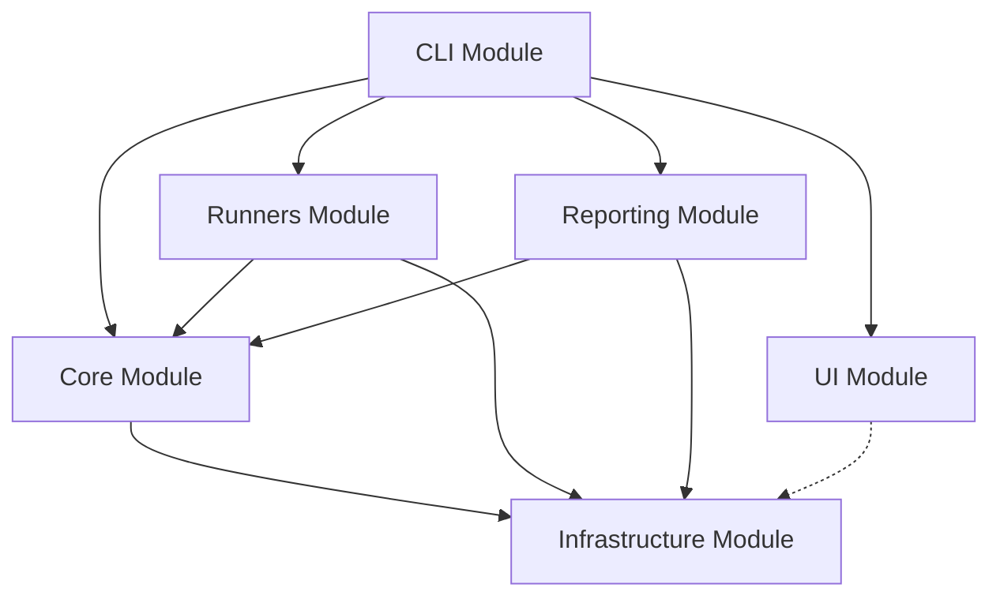

# Design Document: Codebase Modularization

## Overview

This design outlines the reorganization of the Signaler codebase from a flat file structure to a modular architecture. The goal is to improve maintainability, reduce coupling, and make the codebase more extensible for future development.

## Architecture

### Current State Analysis

The current `src/` directory contains 50+ files in a flat structure, making it difficult to:
- Understand the system's architecture at a glance
- Locate related functionality
- Add new features without affecting existing code
- Maintain clear separation of concerns

### Target Module Structure

```
src/
├── core/                    # Core auditing engine
│   ├── types.ts            # Shared type definitions
│   ├── config.ts           # Configuration management
│   ├── audit-engine.ts     # Core audit orchestration
│   └── index.ts            # Public API exports
├── cli/                     # Command-line interface
│   ├── commands/           # Individual CLI commands
│   │   ├── audit.ts
│   │   ├── measure.ts
│   │   ├── bundle.ts
│   │   └── index.ts
│   ├── shell/              # Interactive shell
│   │   ├── shell.ts
│   │   └── commands.ts
│   ├── args/               # Argument parsing
│   │   ├── parser.ts
│   │   └── validation.ts
│   └── index.ts
├── runners/                 # Audit execution engines
│   ├── lighthouse/         # Lighthouse-specific
│   │   ├── runner.ts
│   │   ├── worker.ts
│   │   ├── capture.ts
│   │   └── index.ts
│   ├── measure/            # Fast measurement
│   │   ├── runner.ts
│   │   ├── types.ts
│   │   └── index.ts
│   ├── accessibility/      # A11y audits
│   ├── health/             # Health checks
│   ├── bundle/             # Bundle analysis
│   ├── links/              # Link crawler
│   ├── headers/            # Security headers
│   ├── console/            # Console monitoring
│   └── index.ts            # Runner registry
├── reporting/              # Output generation
│   ├── generators/         # Report generators
│   │   ├── html.ts
│   │   ├── json.ts
│   │   ├── markdown.ts
│   │   └── index.ts
│   ├── formatters/         # Data formatters
│   │   ├── summary.ts
│   │   ├── issues.ts
│   │   └── index.ts
│   ├── artifacts/          # Artifact management
│   │   ├── navigation.ts
│   │   ├── storage.ts
│   │   └── index.ts
│   └── index.ts
├── infrastructure/         # Cross-cutting concerns
│   ├── platform/           # Platform services
│   │   ├── detector.ts
│   │   ├── paths.ts
│   │   └── index.ts
│   ├── network/            # Network utilities
│   │   ├── download.ts
│   │   ├── webhooks.ts
│   │   └── index.ts
│   ├── security/           # Security utilities
│   │   ├── integrity.ts
│   │   ├── verification.ts
│   │   └── index.ts
│   ├── filesystem/         # File operations
│   │   ├── utils.ts
│   │   ├── output.ts
│   │   └── index.ts
│   └── index.ts
├── ui/                     # User interface components
│   ├── components/         # Reusable UI components
│   │   ├── panel.ts
│   │   ├── table.ts
│   │   ├── progress.ts
│   │   └── index.ts
│   ├── themes/             # Styling and themes
│   │   ├── theme.ts
│   │   ├── colors.ts
│   │   └── index.ts
│   └── index.ts
└── index.ts                # Main entry point
```

## Components and Interfaces

### Core Module

**Purpose**: Central auditing engine and shared functionality

**Key Components**:
- `AuditEngine`: Orchestrates audit execution across runners
- `ConfigManager`: Handles configuration loading and validation
- `TypeDefinitions`: Shared types used across modules

**Public API**:
```typescript
export interface AuditEngine {
  runAudit(config: AuditConfig): Promise<AuditResult>;
  getAvailableRunners(): RunnerInfo[];
  validateConfig(config: unknown): AuditConfig;
}

export interface AuditConfig {
  baseUrl: string;
  pages: PageConfig[];
  runners: RunnerConfig[];
  output: OutputConfig;
}
```

### CLI Module

**Purpose**: Command-line interface and user interaction

**Key Components**:
- `CommandRegistry`: Manages available CLI commands
- `ArgumentParser`: Handles command-line argument parsing
- `InteractiveShell`: Provides interactive command execution

**Public API**:
```typescript
export interface CLICommand {
  name: string;
  description: string;
  execute(args: string[]): Promise<void>;
}

export interface CommandRegistry {
  register(command: CLICommand): void;
  execute(commandName: string, args: string[]): Promise<void>;
}
```

### Runners Module

**Purpose**: Pluggable audit execution engines

**Key Components**:
- `RunnerInterface`: Common interface for all audit runners
- `LighthouseRunner`: Lighthouse-based performance audits
- `MeasureRunner`: Fast CDP-based measurements

**Public API**:
```typescript
export interface AuditRunner {
  name: string;
  version: string;
  run(config: RunnerConfig): Promise<RunnerResult>;
  validate(config: RunnerConfig): boolean;
}

export interface RunnerRegistry {
  register(runner: AuditRunner): void;
  get(name: string): AuditRunner | undefined;
  list(): AuditRunner[];
}
```

### Reporting Module

**Purpose**: Output generation and formatting

**Key Components**:
- `ReportGenerator`: Creates reports in various formats
- `ArtifactManager`: Manages output artifacts and navigation
- `DataFormatter`: Formats audit data for different outputs

**Public API**:
```typescript
export interface ReportGenerator {
  generate(data: AuditResult, format: OutputFormat): Promise<Report>;
  getSupportedFormats(): OutputFormat[];
}

export interface Report {
  format: OutputFormat;
  content: string | Buffer;
  metadata: ReportMetadata;
}
```

### Infrastructure Module

**Purpose**: Cross-cutting platform and utility services

**Key Components**:
- `PlatformDetector`: OS and environment detection
- `DownloadManager`: File download and caching
- `IntegrityVerifier`: Security and integrity checks

**Public API**:
```typescript
export interface PlatformService {
  detectPlatform(): PlatformInfo;
  getStandardPaths(): StandardPaths;
  checkPermissions(): PermissionInfo;
}

export interface NetworkService {
  download(url: string, options?: DownloadOptions): Promise<Buffer>;
  verify(data: Buffer, checksum: string): boolean;
}
```

### UI Module

**Purpose**: User interface components and styling

**Key Components**:
- `ComponentLibrary`: Reusable UI components
- `ThemeManager`: Styling and color management
- `ProgressIndicator`: Progress display utilities

**Public API**:
```typescript
export interface UIComponent {
  render(data: unknown): string;
  getRequiredWidth(): number;
}

export interface Theme {
  colors: ColorPalette;
  formatting: FormatOptions;
  apply(text: string, style: StyleName): string;
}
```

## Data Models

### Module Dependency Graph



### File Migration Mapping

| Current File | Target Location | Notes |
|--------------|-----------------|-------|
| `cli.ts` | `cli/commands/audit.ts` | Split into command-specific files |
| `measure-cli.ts` | `cli/commands/measure.ts` | Move to CLI commands |
| `lighthouse-runner.ts` | `runners/lighthouse/runner.ts` | Group Lighthouse files |
| `lighthouse-worker.ts` | `runners/lighthouse/worker.ts` | Group Lighthouse files |
| `lighthouse-capture.ts` | `runners/lighthouse/capture.ts` | Group Lighthouse files |
| `types.ts` | `core/types.ts` | Central type definitions |
| `config.ts` | `core/config.ts` | Core configuration |
| `platform-detector.ts` | `infrastructure/platform/detector.ts` | Platform services |
| `download-manager.ts` | `infrastructure/network/download.ts` | Network utilities |
| `integrity-verifier.ts` | `infrastructure/security/integrity.ts` | Security utilities |
| `ui/render-panel.ts` | `ui/components/panel.ts` | UI components |
| `ui/render-table.ts` | `ui/components/table.ts` | UI components |
| `ui/ui-theme.ts` | `ui/themes/theme.ts` | Theme management |

## Correctness Properties

*A property is a characteristic or behavior that should hold true across all valid executions of a system-essentially, a formal statement about what the system should do. Properties serve as the bridge between human-readable specifications and machine-verifiable correctness guarantees.*

### Property 1: Module Isolation
*For any* module in the system, importing from a module should only access its public API and not internal implementation details
**Validates: Requirements 8.1, 8.2**

### Property 2: Dependency Hierarchy
*For any* module dependency, the dependency graph should be acyclic and follow the defined hierarchy (CLI → Runners → Core, etc.)
**Validates: Requirements 8.1, 8.2**

### Property 3: API Compatibility
*For any* public API function, the reorganized code should maintain the same interface and behavior as the original implementation
**Validates: Requirements 9.1, 9.2**

### Property 4: File Organization Consistency
*For any* file in the new module structure, it should be located in the correct module based on its primary responsibility
**Validates: Requirements 1.1, 1.2**

### Property 5: Import Path Resolution
*For any* import statement in the reorganized code, it should resolve to the correct module and not create circular dependencies
**Validates: Requirements 8.2, 10.4**

## Error Handling

### Module Loading Errors
- **Missing Module**: Provide clear error messages when required modules are not found
- **Circular Dependencies**: Detect and report circular dependency issues at build time
- **API Mismatches**: Validate interface compatibility between modules

### Migration Errors
- **Broken Imports**: Automatically detect and report broken import paths
- **Missing Exports**: Identify when public APIs are accidentally removed
- **Test Failures**: Ensure all tests pass after each migration step

## Testing Strategy

### Unit Testing
- Test each module in isolation using dependency injection
- Mock external module dependencies to ensure true unit testing
- Validate public API contracts for each module

### Integration Testing
- Test module interactions through well-defined interfaces
- Verify that the dependency hierarchy is maintained
- Test end-to-end workflows across multiple modules

### Migration Testing
- Create comprehensive test suite before starting migration
- Run tests after each file move to ensure no regressions
- Validate that all import paths resolve correctly

### Property-Based Testing
- Generate random module configurations to test dependency resolution
- Test API compatibility with various input combinations
- Verify that module boundaries are respected under all conditions

Each property test should run a minimum of 100 iterations and be tagged with:
**Feature: codebase-modularization, Property {number}: {property_text}**