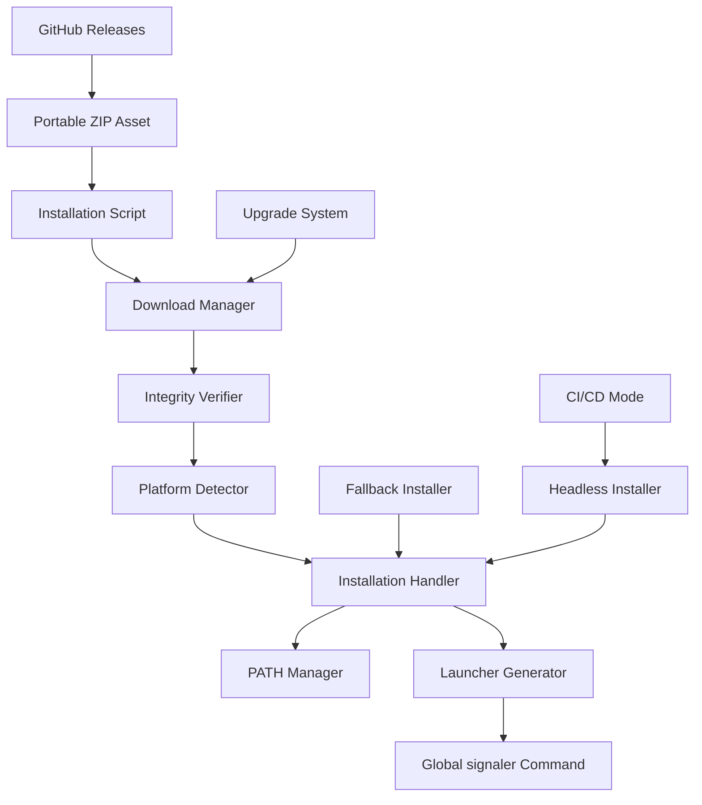

# Design Document

## Overview

This design addresses the distribution reliability challenges for Signaler, a web performance auditing tool. The current system uses a hybrid architecture with a Rust launcher and Node.js engine, distributed via GitHub Releases with registry-free installation scripts. The design focuses on improving reliability, error handling, integrity verification, and cross-platform compatibility while maintaining the registry-free approach.

## Architecture

### Current Architecture Analysis

The existing system consists of:

1. **Rust Launcher** (`launcher/`): Stable entrypoint that orchestrates engine execution
2. **Node.js Engine** (`src/`): Core audit logic and artifact generation
3. **Installation Scripts** (`release-assets/`): PowerShell and Bash scripts for automated installation
4. **Portable ZIP Distribution**: Self-contained packages distributed via GitHub Releases

### Enhanced Distribution Architecture



The enhanced architecture adds:
- **Download Manager**: Robust download handling with retries and progress tracking
- **Integrity Verifier**: Checksum validation and source verification
- **Platform Detector**: Enhanced OS/shell detection and compatibility checking
- **Installation Handler**: Improved error handling and fallback mechanisms
- **PATH Manager**: Reliable PATH manipulation across different environments
- **Upgrade System**: Seamless version management and update mechanisms

## Components and Interfaces

### Download Manager

**Purpose**: Handle reliable downloading of portable ZIP assets from GitHub Releases

**Interface**:
```typescript
interface DownloadManager {
  downloadWithRetry(url: string, destination: string, options: DownloadOptions): Promise<DownloadResult>
  validateSource(url: string): Promise<boolean>
  getDownloadProgress(): DownloadProgress
}

interface DownloadOptions {
  maxRetries: number
  retryDelay: number
  timeout: number
  userAgent: string
  checksumUrl?: string
}

interface DownloadResult {
  success: boolean
  filePath: string
  checksum?: string
  error?: string
}
```

**Key Features**:
- Exponential backoff retry logic
- Progress tracking for large downloads
- Network timeout handling
- User-Agent identification
- Partial download resumption support

### Integrity Verifier

**Purpose**: Verify the authenticity and integrity of downloaded assets

**Interface**:
```typescript
interface IntegrityVerifier {
  verifyChecksum(filePath: string, expectedChecksum: string, algorithm: string): Promise<boolean>
  verifySource(downloadUrl: string, trustedDomains: string[]): boolean
  validateSignature(filePath: string, signatureFile: string): Promise<boolean>
}
```

**Key Features**:
- SHA-256 checksum verification
- Source domain validation (github.com/githubusercontent.com)
- Optional GPG signature verification
- File corruption detection

### Platform Detector

**Purpose**: Detect operating system, shell environment, and installation capabilities

**Interface**:
```typescript
interface PlatformDetector {
  detectOS(): OperatingSystem
  detectShell(): ShellEnvironment
  checkPermissions(): PermissionLevel
  findInstallationPaths(): InstallationPaths
}

interface OperatingSystem {
  type: 'windows' | 'macos' | 'linux'
  version: string
  architecture: string
}

interface ShellEnvironment {
  type: 'powershell' | 'cmd' | 'bash' | 'zsh' | 'fish'
  version: string
  profilePaths: string[]
}

interface InstallationPaths {
  globalBinDir: string
  userBinDir: string
  configDir: string
  cacheDir: string
}
```

**Key Features**:
- Cross-platform OS detection
- Shell type and version identification
- Permission level assessment
- Standard directory path resolution

### Installation Handler

**Purpose**: Manage the installation process with comprehensive error handling

**Interface**:
```typescript
interface InstallationHandler {
  install(packagePath: string, options: InstallOptions): Promise<InstallationResult>
  createLauncher(installDir: string, binDir: string): Promise<void>
  updatePATH(binDir: string, scope: 'user' | 'system'): Promise<void>
  rollback(backupPath: string): Promise<void>
}

interface InstallOptions {
  installDir: string
  binDir: string
  addToPath: boolean
  createBackup: boolean
  scope: 'user' | 'system'
}

interface InstallationResult {
  success: boolean
  installPath: string
  launcherPath: string
  pathUpdated: boolean
  backupPath?: string
  error?: InstallationError
}
```

**Key Features**:
- Atomic installation with rollback capability
- Backup creation before installation
- Graceful handling of permission errors
- Multiple installation scope support (user vs system)

### Upgrade System

**Purpose**: Handle seamless updates while preserving user data

**Interface**:
```typescript
interface UpgradeSystem {
  checkForUpdates(): Promise<UpdateInfo>
  performUpgrade(version: string): Promise<UpgradeResult>
  preserveUserData(currentInstall: string, newInstall: string): Promise<void>
  validateUpgrade(newInstall: string): Promise<boolean>
}

interface UpdateInfo {
  currentVersion: string
  latestVersion: string
  updateAvailable: boolean
  releaseNotes: string
  downloadUrl: string
}
```

**Key Features**:
- Version comparison and update detection
- Configuration and artifact preservation
- Upgrade validation and testing
- Rollback capability on failure

## Data Models

### Installation Manifest

```typescript
interface InstallationManifest {
  version: string
  installDate: string
  installPath: string
  launcherPath: string
  configPath: string
  platform: {
    os: string
    arch: string
    shell: string
  }
  installation: {
    scope: 'user' | 'system'
    pathUpdated: boolean
    backupPath?: string
  }
  integrity: {
    checksum: string
    algorithm: string
    verified: boolean
  }
}
```

### Error Context

```typescript
interface ErrorContext {
  operation: string
  phase: 'download' | 'verify' | 'extract' | 'install' | 'configure'
  platform: OperatingSystem
  permissions: PermissionLevel
  networkStatus: 'online' | 'offline' | 'limited'
  error: {
    code: string
    message: string
    details: Record<string, unknown>
  }
  suggestions: string[]
}
```

## Correctness Properties

*A property is a characteristic or behavior that should hold true across all valid executions of a system-essentially, a formal statement about what the system should do. Properties serve as the bridge between human-readable specifications and machine-verifiable correctness guarantees.*

### Property Reflection

After analyzing all acceptance criteria, several properties can be consolidated to eliminate redundancy:

- Network error handling properties (1.4, 3.5, 5.3) can be combined into a comprehensive network error property
- Cross-platform compatibility properties (2.1, 2.2, 2.3) can be unified into a single platform compatibility property  
- Installation feedback properties (6.1, 6.2, 6.3) can be consolidated into a comprehensive user feedback property
- Permission handling properties (1.5, 2.5, 5.4) can be combined into a unified permission fallback property

### Core Properties

Property 1: Installation download reliability
*For any* valid PowerShell or Bash environment with network connectivity, running the installation command should successfully download the latest portable ZIP from GitHub Releases
**Validates: Requirements 1.1, 1.2**

Property 2: Global command availability
*For any* successful installation, the `signaler` command should be available globally in the user's PATH
**Validates: Requirements 1.3**

Property 3: Network error handling
*For any* network failure condition (offline, limited connectivity, timeout), the system should provide clear error messages with specific guidance about connectivity requirements and retry suggestions
**Validates: Requirements 1.4, 3.5, 5.3**

Property 4: Permission fallback handling
*For any* permission restriction scenario (system directory access denied, insufficient privileges), the installation script should offer user-local installation alternatives with clear guidance
**Validates: Requirements 1.5, 2.5, 5.4**

Property 5: Cross-platform compatibility
*For any* supported operating system (Windows, macOS, Linux) and shell environment (PowerShell, CMD, Bash, Zsh), Signaler should function correctly after installation
**Validates: Requirements 2.1, 2.2, 2.3**

Property 6: Dependency validation
*For any* system missing Node.js or other required dependencies, the system should provide clear guidance on specific missing components and installation instructions
**Validates: Requirements 2.4, 6.4**

Property 7: Version management reliability
*For any* upgrade operation, the system should check for newer versions, download updates when available, and preserve existing configuration files and audit artifacts
**Validates: Requirements 3.1, 3.2, 3.3**

Property 8: Upgrade rollback safety
*For any* failed upgrade operation, the system should maintain the previous working installation without data loss
**Validates: Requirements 3.4**

Property 9: Portable mode functionality
*For any* portable ZIP extraction, the system should run directly from the extracted folder with full functionality equivalent to the globally installed version, including proper `run.cmd` and `run.sh` scripts
**Validates: Requirements 4.1, 4.2, 4.3**

Property 10: Portable mode isolation
*For any* portable installation location or multiple concurrent portable versions, each should operate independently without conflicts or requiring reconfiguration when moved
**Validates: Requirements 4.4, 4.5**

Property 11: Headless operation capability
*For any* CI/CD or headless environment, installation should complete without interactive prompts and execution should work without GUI components
**Validates: Requirements 5.1, 5.2**

Property 12: Concurrent installation safety
*For any* multiple simultaneous installation operations, each should complete successfully without conflicts or corruption
**Validates: Requirements 5.5**

Property 13: Comprehensive user feedback
*For any* installation, upgrade, or execution operation, the system should provide clear progress information, specific error messages with suggested solutions, and detailed compatibility information when issues occur
**Validates: Requirements 6.1, 6.2, 6.3, 6.5**

Property 14: Security verification
*For any* download operation, the system should verify the source is the official repository, validate file integrity using checksums, abort on verification failures with clear error messages, and validate SSL certificates properly
**Validates: Requirements 7.1, 7.2, 7.3, 7.4**

Property 15: Security warnings
*For any* insecure connection attempt, the system should warn users about potential security risks
**Validates: Requirements 7.5**

<function_calls>
<invoke name="prework">
<parameter name="featureName">distribution-reliability

## Error Handling

### Error Classification

The system categorizes errors into distinct types for appropriate handling:

1. **Network Errors**: Connection timeouts, DNS failures, HTTP errors
2. **Permission Errors**: Insufficient privileges, read-only filesystems, access denied
3. **Integrity Errors**: Checksum mismatches, corrupted downloads, invalid signatures
4. **Dependency Errors**: Missing Node.js, incompatible versions, missing system tools
5. **Platform Errors**: Unsupported OS, incompatible shell, missing system features
6. **Concurrent Access Errors**: File locks, simultaneous installations, resource conflicts

### Error Recovery Strategies

**Network Errors**:
- Exponential backoff retry with jitter
- Alternative download mirrors when available
- Offline mode detection and guidance
- Partial download resumption

**Permission Errors**:
- Automatic fallback to user-local installation
- Clear guidance on permission requirements
- Alternative installation methods (portable mode)
- Sudo/elevation prompts when appropriate

**Integrity Errors**:
- Immediate installation abort
- Clear security warnings
- Re-download suggestions
- Alternative verification methods

**Dependency Errors**:
- Detailed missing component identification
- Platform-specific installation guidance
- Version compatibility checking
- Alternative dependency sources

### Error Message Standards

All error messages follow this structure:
```
[ERROR_CODE] Brief description
Details: Specific technical information
Suggestion: Actionable next steps
Documentation: Link to relevant help
```

Example:
```
[DIST_001] Failed to download portable ZIP
Details: Network timeout after 30 seconds connecting to github.com
Suggestion: Check internet connection and retry, or download manually from https://github.com/Dendro-X0/signaler/releases
Documentation: https://github.com/Dendro-X0/signaler/docs/troubleshooting.md#network-issues
```

## Testing Strategy

### Dual Testing Approach

The testing strategy employs both unit tests and property-based tests to ensure comprehensive coverage:

**Unit Tests**:
- Specific installation scenarios (Windows PowerShell, macOS Bash, Linux distributions)
- Error condition examples (network failures, permission denials, corrupted downloads)
- Integration points between components (launcher-engine communication, PATH updates)
- Edge cases (empty responses, malformed JSON, missing files)

**Property-Based Tests**:
- Universal properties across all supported platforms and environments
- Comprehensive input coverage through randomized testing
- Correctness validation across many generated scenarios
- Minimum 100 iterations per property test

### Property-Based Testing Configuration

Each property test will be implemented using the appropriate testing framework for the target language:
- **TypeScript/Node.js**: fast-check library
- **Rust**: proptest library
- **Shell Scripts**: Custom property generators with multiple test runs

Property tests will be tagged with comments referencing their design document properties:
```typescript
// Feature: distribution-reliability, Property 1: Installation download reliability
```

### Test Environment Matrix

Testing will cover the following environment combinations:

**Operating Systems**:
- Windows 10/11 (PowerShell 5.1, PowerShell 7+, Command Prompt)
- macOS (Bash, Zsh, latest 3 versions)
- Linux (Ubuntu, CentOS, Alpine, Debian - Bash, Zsh, Fish)

**Network Conditions**:
- High-speed broadband
- Limited bandwidth
- Intermittent connectivity
- Corporate proxy/firewall
- Offline scenarios

**Permission Levels**:
- Administrator/root access
- Standard user privileges
- Restricted environments (CI/CD containers)
- Read-only filesystem scenarios

**Concurrent Scenarios**:
- Multiple simultaneous installations
- Parallel upgrade operations
- Mixed portable and installed versions

### Integration Testing

Integration tests will verify:
- End-to-end installation workflows
- Cross-component communication (Rust launcher ↔ Node.js engine)
- Real GitHub API interactions (with rate limiting considerations)
- Actual file system operations and PATH modifications
- Real network downloads and integrity verification

### Performance Testing

Performance benchmarks will measure:
- Installation time across different network speeds
- Download resumption efficiency
- Upgrade operation speed
- Startup time after installation
- Memory usage during large downloads

The testing strategy ensures that all correctness properties are validated through both specific examples (unit tests) and universal behavior verification (property-based tests), providing confidence in the system's reliability across diverse real-world scenarios.