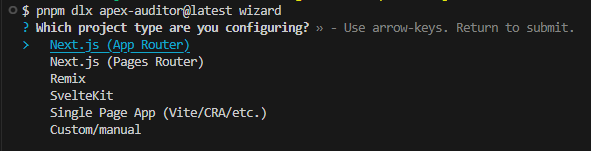

# ApexAuditor

ApexAuditor is a small, framework-agnostic Lighthouse runner that gives you **fast, structured insights** across multiple pages and devices.

It focuses on:

- **Multi-page, multi-device audits**: run Lighthouse across your key flows in one shot.
- **Framework flexibility**: works with any stack that serves HTTP (Next.js, Remix, Vite/React, SvelteKit, Rails, static sites, etc.).
- **Smart route discovery**: auto-detects routes for Next.js (App/Pages), Remix, SvelteKit, and can crawl generic SPAs.
- **Developer-friendly reports**: readable console output, Markdown tables, and JSON summaries for CI.

---

## Example output

Terminal summary:


Wizard route selection:



---

## Installation

Install as a dev dependency (recommended):

```bash
pnpm add -D apex-auditor
# or
npm install --save-dev apex-auditor
```

You can also run it without installing by using your package manager's "dlx"/"npx" style command, for example:

```bash
pnpm dlx apex-auditor@latest wizard
```

---

## Common commands

All commands are available as a CLI named `apex-auditor` once installed.

### Quickstart (auto-detect routes and run a one-off audit)

```bash
apex-auditor quickstart --base-url http://localhost:3000
```

### Wizard (interactive config with route auto-detection)

```bash
apex-auditor wizard
```

The wizard can detect routes for:

- Next.js (App Router / Pages Router)
- Remix
- SvelteKit
- Single Page Apps (Vite/CRA/etc., via HTML crawl)

### Audit (run using an existing config)

```bash
apex-auditor audit --config apex.config.json
```

Useful flags:

- `--ci` – enable CI mode with budgets and non-zero exit codes.
- `--no-color` / `--color` – control ANSI colours in console output.
- `--log-level <silent|error|info|verbose>` – override Lighthouse log level.

---

## Further documentation

For detailed guides, configuration options, and CI examples, see the `docs/` directory:

- `docs/getting-started.md` – installation, quickstart, wizard, and audit flows.
- `docs/configuration-and-routes.md` – `apex.config.json` schema and route detection details.
- `docs/cli-and-ci.md` – CLI flags, CI mode, budgets, and example workflows.

For the longer-term vision and planned features, see `ROADMAP.md`.
